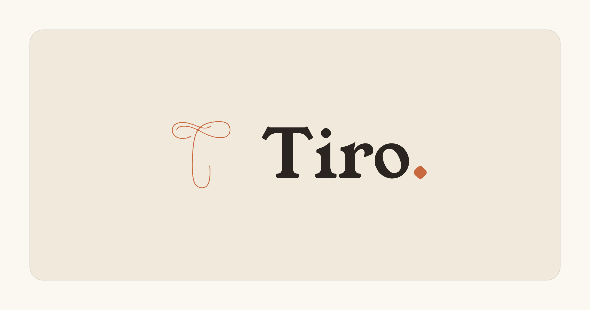

<p align="center">
  
</p>

<h1 align="center">Tiro</h1>

<p align="center">
  <strong>A multimodal document editor — "Google Docs with first-class media embeds."</strong><br/>
  One page holds your prose, your photographs, your voice memos, your video and your links.<br/>
  Then it ships as a PDF, a Markdown file, or a public web page at <code>&lt;slug&gt;.tiro.works</code>.
</p>

<p align="center">
  <a href="https://tiro.works"><strong>Live → tiro.works</strong></a>
</p>

<p align="center">
  
  
  
  
  
  
</p>

---

## Table of contents

1. [What Tiro is](#what-tiro-is)
2. [Feature tour](#feature-tour)
   - [Authentication](#1-authentication--passwordless-email-otp--google)
   - [Workspace, folders & trash](#2-workspace-folders--trash)
   - [The editor — built from scratch on `contenteditable`](#3-the-editor--built-from-scratch-on-contenteditable)
   - [Media embeds](#4-media-embeds--images-video-audio-links)
   - [Go Marco — type-a-code formatting](#5-go-marco--type-a-code-formatting)
   - [Outline sidebar & tools](#6-outline-sidebar--tools)
   - [Export — PDF & Markdown](#7-export--pdf--markdown)
   - [Publish to the web](#8-publish-to-the-web--slugtiroworks)
   - [Theming — Yolk & Innocence](#9-theming--yolk--innocence)
   - [Landing page](#10-landing-page)
3. [Architecture](#architecture)
   - [Stack](#stack)
   - [Request lifecycle & auth model](#request-lifecycle--auth-model)
   - [Data model & Row-Level Security](#data-model--row-level-security)
   - [Storage layout](#storage-layout)
   - [Document content model](#document-content-model)
4. [Engineering decisions worth knowing about](#engineering-decisions-worth-knowing-about)
5. [Project structure](#project-structure)
6. [Running it locally](#running-it-locally)
7. [Deployment](#deployment)
8. [Known limitations & roadmap](#known-limitations--roadmap)

---

## What Tiro is

Tiro is a web-based, multi-user document editor for writers, students and creators who think in more
than just words. The premise: when you draft a piece, the reference photo, the voice memo you recorded
on a walk, the clip you filmed, and the article you're responding to should live **inside the same
document** — not scattered across a docs tool, a notes app and a drive folder.

Every document in Tiro is:

- **Private by default** — enforced by Postgres Row-Level Security, not just application code.
- **Multimodal** — text, images, audio (with a real waveform player), video, and rich link cards.
- **Organised many-to-many** — one document can live in several folders at once; folders nest.
- **Shippable** — export to PDF or Markdown, or publish a snapshot to a public subdomain.

It's named after **Marcus Tullius Tiro**, Cicero's scribe and the inventor of shorthand — the original
act of turning fleeting speech into durable, shareable writing. That lineage shows up in the product:
the in-editor shorthand mode is called *Go Marco*, and the codes you type are *marcos*.

The whole editor is **hand-built on the browser's native `contenteditable`** — no TipTap, ProseMirror,
Slate, Lexical, or Quill. Every behaviour described below (formatting, media, undo-safe deletion,
autosave, exports) is implemented directly against the DOM and the Selection/Range APIs.

---

## Feature tour

### 1. Authentication — passwordless email OTP + Google

- **Two sign-in paths:** a 6-digit **email one-time code** (no passwords anywhere in the system) and
  **"Continue with Google"** (OAuth via Supabase; the Google app is published, so any Google account works).
- **Cookie-based sessions** via `@supabase/ssr`, so Server Components, Server Actions and the request proxy
  all know who the user is without a client round-trip.
- **Transactional email through Resend SMTP** with a custom on-brand template
  (`supabase/templates/magic_link.html`). The code is rendered dark-on-light with a yolk accent bar so it
  survives email clients that recolour for dark mode.
- **OAuth return handler** at `app/auth/callback/route.ts` exchanges the code for a session and redirects
  to the intended page.

### 2. Workspace, folders & trash

- **The desk (`/workspace`)** lists your top-level folders and live documents in a responsive
  Google-Docs-style grid with document thumbnails and per-folder document counts.
- **Folders are many-to-many** (`document_folders` join table): file one doc in several folders and it
  stays a single source of truth. Folders nest via a nullable `parent_id`.
- **Organising is drag-and-drop:** documents and folders are HTML5-draggable; folder cards are drop targets
  (drop a doc → file it; drop a folder → nest it, with a **cycle guard** so a folder can never be moved into
  its own descendant). A `⋯` menu on each card offers the same operations plus rename/delete.
- **Trash with restore:** deleting is a **soft delete** (`deleted_at`). The `/trash` view groups trashed
  docs and folders, offers *Restore* / *Delete forever*, and an *Empty trash*. Permanent deletion also
  **purges the document's media from storage** in one prefix sweep (see [Storage layout](#storage-layout)).
- **Profile (`/profile`):** display name, status line, avatar upload to a public-read bucket, and a
  draggable circular photo viewer (portal-rendered, closes on outside-click/Escape).
- **All mutations are Server Actions** (`app/workspace/actions.ts`) — each one re-verifies the user with
  `getUser()` before touching the database. There are no hand-written API routes for CRUD.
- **Custom themed dialogs** replace every native `confirm()`/`prompt()`: a promise-based
  `confirmDialog()` / `promptDialog()` API (`components/ui/dialog.tsx`) rendering a top banner with focus
  trapping, Escape/Enter handling and a theme-tuned danger red for destructive actions.

### 3. The editor — built from scratch on `contenteditable`

`app/doc/[docId]/document-editor.tsx` is the heart of the project. It is a client component wrapping a
`contenteditable` surface, a sticky toolbar, and a debounced autosave — with no editor framework.

**Formatting**
- Bold / italic / underline, headings H1–H5, left/centre/right alignment, bulleted and numbered lists.
- **Checklists** — a `<ul data-checklist>` whose items carry a non-editable check box. Converts a
  multi-line selection in place, toggles back to paragraphs, and has custom **Enter** and **Backspace**
  handling because native `contenteditable` refuses to merge lines across a non-editable element at the
  head of an item.
- **Per-selection font family** (12 options: Fraunces, Hanken Grotesk, Lora, Source Serif 4, Inter,
  JetBrains Mono, plus Georgia / Times / Arial / Calibri / Helvetica and *Default*) and a **font-size
  stepper** (Word-style 6–96 scale, body = 11 ≙ 18px).
- **Per-selection text colour** with a 10×10 swatch grid, a canvas-drawn **HSV colour wheel** with
  brightness slider and HEX/RGB inputs, and 16 **custom colour slots** you fill by dragging the preview
  into them (persisted in `localStorage`).
- **One consistent modifier:** all formatting shortcuts live on **Ctrl** (`Ctrl+B/I/U`, `Ctrl+L/E/R`
  for alignment); the browser's native `Cmd+B/I/U` are suppressed so `Cmd` stays free for the browser.

**How inline styling works without a framework** — `execCommand` can't set arbitrary `font-size: 18px`
or a `var(--font-*)` family. `lib/inline-style.ts` uses `execCommand("fontSize", "7")` purely as a
**marker** so the browser does the hard multi-node selection-wrapping, then rewrites every resulting
`<font size="7">` into a `<span style="…">` with the real style, strips the same property from descendant
spans (so repeated nudges never stack), and re-selects the rewritten range so you can keep nudging.

**Persistence**
- **Autosave** is debounced (~1 s) and writes `{ version: 2, html }` to `documents.content`. Before saving,
  a clone is scrubbed of runtime-only chrome (drag handles, selection rings, still-uploading placeholders).
- **Save-time orphan reconciliation:** every save diffs the media paths present in the HTML against the
  set known to have been uploaded, and deletes anything no longer referenced from storage. Media removed
  from the document never lingers in the bucket.
- A **gliding caret** (`lib/use-smooth-caret.ts`) hides the native caret and draws its own ink bar that
  transitions between positions — reading like a pen nib moving across paper. Falls back to the native
  caret for IME composition, touch devices and `prefers-reduced-motion`.

### 4. Media embeds — images, video, audio, links

All media is inserted from a single **Insert** dropdown (or by paste / drag-and-drop), uploaded to
owner-scoped Supabase Storage buckets, and lives in the document as a serialisable `<figure>` with
`data-*` attributes. The editor guarantees figures are always **top-level blocks** (never nested inside
another non-editable node) and that **Backspace at the start of the next block deletes the figure through
the editing pipeline** (`execCommand("delete")`) so `Cmd/Ctrl+Z` brings it back.

| Medium | What happens on insert | Editing affordances |
|---|---|---|
| **Image** | Compressed **client-side to WebP** (≤1600 px, EXIF orientation baked in) before upload to `doc-images`. | Floating contextual toolbar: resize handle, align, caption, flip H/V, filters (grayscale / sepia / contrast), and a **crop** tool that re-encodes CORS-safely via `<canvas>`. |
| **Video** | **No server, no ffmpeg.** `lib/video-prepare.ts` validates ≤60 s and ≤200 MB, captures a **poster frame** via `<video>` → `<canvas>`, warns if the file is likely HEVC (won't play outside Safari), then uploads the original + poster to `doc-videos`. | Align, caption, resize, delete. |
| **Audio** | `lib/audio-prepare.ts` decodes the file with `OfflineAudioContext`, computes **56 waveform peaks**, and enforces a 60 s cap (longer clips are trimmed and re-encoded to WAV with a dependency-free PCM encoder). Uploads to `doc-audio`. | A **custom waveform player** — play/pause, click-to-seek, and a yolk-coloured "played" fill implemented as a `clip-path` over the peak bars. Fully serialisable (`data-peaks`), so the same markup plays back on the public page. |
| **Link** | Pasting a URL calls a Server Action (`lib/unfurl-actions.ts`) that fetches the page, reads **OpenGraph/Twitter meta**, and for YouTube/Vimeo uses **oEmbed** to get a clean thumbnail + an embeddable player. Includes SSRF guards (blocks localhost / private ranges), a 6 s timeout and a 512 KB read cap. | Renders as a link card; video providers play inline on click. |

Video, audio and link cards carry a hover **drag handle** (injected at runtime by a `MutationObserver`,
stripped on save) so you can nudge them horizontally without hijacking their own controls. Images are
grabbed directly.

### 5. Go Marco — type-a-code formatting

A modal, keyboard-first formatting mode. Toggle it from the toolbar, select some text, type a short code,
press **Enter**. A bottom-centre HUD shows the code as you type it and flashes *"polo"* on success.

| Group | Marcos |
|---|---|
| Emphasis | `b` `i` `u` |
| Align | `l` `e` `r` |
| Structure | `h1`–`h5` `p` |
| Type | `f ‹name›` `fs ‹n›` `+` `-` `fc ‹colour›` |
| Lists | `bd` `bn` `bc` |
| Insert | `ii` `iv` `ia` |
| Ship | `eweb` `epdf` `emd` |

Implementation notes: every captured key is `preventDefault`-ed, so the selection is preserved with no
snapshot/restore dance; `runMarco()` maps codes to the **existing** toolbar handlers rather than
reimplementing them; codes are whole-match so `b` ≠ `bd` and `e` ≠ `eweb`. The list of marcos lives in
one place (`lib/marcos.ts`) and feeds both the in-editor **Marco Shorthands** reference panel and the
landing page cheat sheet, so they can never drift.

### 6. Outline sidebar & tools

- **Document outline** (`outline-panel.tsx`) — a left-gutter panel listing every H1–H5 in the document,
  indented by level; click to scroll (offset for the sticky toolbar), the in-view heading is highlighted.
  It reads headings straight off the live DOM via a `MutationObserver` — no document state threaded
  through React — and is `position: fixed` so the writing column never shifts.
- **Tools → Word count** — a draggable floating pill showing the document's word count, switching to the
  selection's count when text is highlighted.

### 7. Export — PDF & Markdown

Both exporters walk the editor's DOM directly, so they understand Tiro's custom nodes.

- **PDF** (`lib/export-pdf.ts`) — a hand-written renderer on top of **jsPDF** (dynamically imported so it
  only loads on demand). It emits **real, selectable text** with the paper/ink palette: title with a yolk
  rule, H1–H5, bold/italic/underline runs, all three list types (checklists draw a real box + tick),
  images honouring width/alignment/flips/filters, captions, word-wrap, alignment and **automatic page
  breaks**. Media that can't be a PDF degrades gracefully: video → poster + "▶ Video" tag, audio →
  "♪ [audio]" chip, link cards → thumbnail + title + URL. Images are fetched → object URL → canvas →
  JPEG so the canvas is never tainted by cross-origin Supabase URLs. The PDF **opens in a new tab** as a
  `blob:` URL (the tab is opened synchronously inside the click so pop-up blockers allow it).
- **Markdown** (`lib/export-markdown.ts`) — same clone-and-scrub pipeline, emitting Markdown instead of
  jsPDF primitives; images → ``, checklists → `- [x]`, link cards → `[title](url)`.
  Downloads a `.md` file.

### 8. Publish to the web — `<slug>.tiro.works`

Any document can be published as a public page — no login needed to read it.

- **Snapshot, not live.** Publishing copies the title + sanitised HTML into a separate
  `published_pages` table under an auto-generated readable slug (e.g. `quiet-river-4821`). Editing the
  doc doesn't change the public page until you click *Update published version*; *Unpublish* deletes the
  row and the subdomain 404s.
- **Why a separate table:** the private `documents` table is never widened to the anonymous role. The
  public surface is an explicit, minimal projection with a `SELECT … USING (true)` policy, and owner-only
  write policies that also verify the source document belongs to the publisher.
- **Subdomain routing** happens in `proxy.ts`: a request whose host matches `<slug>.tiro.works` (or
  `<slug>.localhost` in dev) is **rewritten** to `/p/<slug>` and skips the auth gate entirely. The
  browser URL stays the subdomain. Pages are also reachable at `tiro.works/p/<slug>`.
- The public renderer (`app/p/[slug]/published-document.tsx`) re-creates only embed interactivity
  (the audio player, link-card play) — no toolbar, no editing. `generateMetadata` produces a title and
  excerpt for link previews.
- **Sanitisation at publish time** strips `<script>`, inline `on*=` handlers and `javascript:` URLs
  before the snapshot is stored.
- Infra: a wildcard `*.tiro.works` domain on Vercel with automatic SSL, which required moving the
  domain's nameservers to Vercel DNS (wildcard certs need the DNS-01 challenge).

### 9. Theming — Yolk & Innocence

Two named themes, dependency-free (no `next-themes`):

- **Yolk** (light, default): warm paper, ink text, an egg-yolk `#ffb300` accent, and a subtle paper-grain
  texture.
- **Innocence** (dark): `#15171c` surface, `#e7ecf2` ink, a baby-blue `#a6d2f2` accent.

The entire app is written against **semantic tokens** (`bg-paper`, `text-ink`, `border-line`,
`bg-yolk`, `bg-danger` …). A single `[data-theme="innocence"]` block in `globals.css` re-points those
tokens, so every surface flips with **zero markup changes**. An inline `<head>` script reads
`localStorage["tiro-theme"]` before first paint, so there's no flash on reload. The toggle itself is
render-stateless (its active half is driven by `html[data-theme]` via CSS), which sidesteps hydration
mismatches.

### 10. Landing page

Logged-out visitors to `/` get a brand landing page (`components/landing/*`) rather than a login wall:

- A hand-drawn **SVG scribble that draws itself on** (`stroke-dashoffset` with `pathLength=1`) as the
  signature "shorthand → text" motif; a **scroll-driven marginal ink line** that draws in proportion to
  page scroll.
- Product proof that's actually true: the mock documents reuse the editor's real `.doc-content` CSS, the
  real waveform player, and the real link-card markup.
- A "Go Marco" band with the full cheat sheet, generated from `lib/marcos.ts`.
- Progressive enhancement throughout: content is visible by default and only JS "arms" the reveal
  animations, so no-JS, crawlers and `prefers-reduced-motion` all get the finished state.
- Site-wide Open Graph / Twitter card images via the App Router `opengraph-image.png` convention.

---

## Architecture

### Stack

| Layer | Choice | Notes |
|---|---|---|
| Framework | **Next.js 16** (App Router) + **React 19** + TypeScript | Turbopack in dev. Next 16's `proxy.ts` (the renamed `middleware`) is the per-request gate. |
| Styling | **Tailwind CSS v4** | Tokens declared via `@theme` in `app/globals.css`; no `tailwind.config`. |
| Fonts | `next/font/google` | Fraunces (display serif) + Hanken Grotesk (body) for the UI; Lora, Source Serif 4, Inter, JetBrains Mono self-hosted for the editor's font picker. |
| Backend | **Supabase** — Postgres, Auth, Storage | Accessed via `@supabase/supabase-js` + `@supabase/ssr`. There is no custom backend server. |
| Editor | Native `contenteditable` + Selection/Range APIs | No editor library. |
| Exports | `jspdf` (dynamic import) | Only dependency beyond the framework and Supabase. |
| Hosting | **Vercel** | Auto-deploys from GitHub `main`; wildcard subdomains for published pages. |
| Email | Resend (SMTP into Supabase Auth) | Custom OTP template. |

### Request lifecycle & auth model

```mermaid
flowchart LR
  B[Browser<br/>session cookie] --> P[proxy.ts]
  P -- "host = slug.tiro.works" --> R[rewrite → /p/slug<br/>no auth check]
  P -- "getUser() · network<br/>refresh + revalidate" --> G{logged in or<br/>public route?}
  G -- no --> L[redirect /login]
  G -- yes --> S[Server Component page<br/>getClaims() · local ES256 verify]
  S -- "query as the user" --> DB[(Supabase Postgres<br/>RLS filters rows)]
  DB --> S --> H[HTML to browser]
  H -. "mutations" .-> A[Server Actions<br/>requireUser → getUser()]
  A --> DB
```

Two different verification calls are used deliberately:

- **`proxy.ts` calls `getUser()`** once per request — the authoritative check. It round-trips to Supabase,
  refreshes the session cookie if needed, and catches a banned/deleted user mid-session.
- **Protected pages call `getClaims()`** — a *local* verification of the JWT's ES256 signature (the project
  uses asymmetric signing keys), so there's **no second network call** per navigation. Measured: this
  removed a duplicate ~375 ms auth round-trip from every page load.
- **Every Server Action calls `getUser()`** again, because actions are the only place data changes.

### Data model & Row-Level Security

```
auth.users ─┬─ 1:1 ─ profiles          (display_name, avatar_url, status)   ← auto-created by trigger
            │
            ├─ 1:N ─ documents         (title, content jsonb, header/footer jsonb, deleted_at)
            │           │
            │           ├─ N:M ─ document_folders ─ N:M ─ folders (name, parent_id ↺ self, deleted_at)
            │           │
            │           └─ 1:0..1 ─ published_pages (slug PK, title, content snapshot)
            │
            └─ 1:N ─ folders
```

**RLS is the privacy guarantee, not the app code.** Every table has `ENABLE ROW LEVEL SECURITY` and
owner-only policies keyed on `auth.uid()`:

- `documents`, `folders`, `profiles` — select/insert/update/delete only where `owner_id = auth.uid()`.
- `document_folders` — policies check ownership of **both** the document and the folder via `EXISTS`.
- `published_pages` — the one exception: public `SELECT`, owner-only writes, with the insert policy also
  verifying the referenced document belongs to the publisher.

Because the database filters rows by the session's user, application queries don't need `WHERE owner_id =
…` clauses — and a bug in a query can't leak another user's documents. Migrations live in
`supabase/migrations/` and are written to be **safely re-runnable** (`IF NOT EXISTS`, drop-then-create
policies).

### Storage layout

Four buckets, all public-read with owner-scoped write policies:

| Bucket | Path scheme | Written by |
|---|---|---|
| `avatars` | `‹uid›/…` | Profile form |
| `doc-images` | `‹uid›/‹docId›/‹id›.webp` | Image insert (client-compressed) |
| `doc-videos` | `‹uid›/‹docId›/‹id›.‹ext›` + `‹id›.jpg` poster | Video insert |
| `doc-audio` | `‹uid›/‹docId›/‹id›.‹ext›` | Audio insert |

The shared `‹uid›/‹docId›/` prefix is deliberate: permanently deleting a document sweeps its media from
all three buckets with a single list-and-remove per bucket, and the save-time reconciliation can compare
the HTML's `data-path` attributes against a known set.

### Document content model

`documents.content` is `{ "version": 2, "html": "<p>…</p><figure data-img …>…</figure>" }`.

- The **saved HTML is the source of truth**; `execCommand` is only a mutation convenience.
- Media figures are self-describing: `figure[data-img|data-video|data-audio|data-link-card]` with
  `data-path`, `data-align`, `data-x` (horizontal offset), `data-peaks` (audio), `data-checked`
  (checklist items) etc. This is what lets the PDF/Markdown exporters and the public page renderer all
  interpret the same markup.
- Legacy `{ "plain": "…" }` rows from the first prototype are auto-migrated to `<p>` HTML on open.
- The `header`/`footer` jsonb columns are reserved for running headers/footers (deferred feature).

---

## Engineering decisions worth knowing about

**No editor framework.** The editor is native `contenteditable`. The trade-off is owning every edge case
(nested figures, checklist Backspace, undo-safe deletion, selection preservation when a colour input
steals focus), but the payoff is a serialisable HTML model that three renderers (editor, public page,
exporters) share without an intermediate document schema, and a bundle with no editor dependency.

**Zero server-side media processing.** An early version transcoded video with ffmpeg inside a Server
Action. It worked for short clips only because they finished under the serverless execution limit —
a ceiling, not a wall. It was removed. Video and audio are now prepared **entirely in the browser**
(poster capture, waveform peaks, WAV trimming), and the original file is stored as-is under explicit
duration/size caps. There is no server compute left to time out.

**Auth verification split.** `getUser()` (network) exactly once per request in the proxy; `getClaims()`
(local signature check) in pages. Same security posture, half the auth latency.

**Snapshot publishing on a separate table.** Publishing never touches the RLS on `documents`. The public
surface is an explicit projection, which also gives snapshot semantics for free.

**Client-side compression before upload.** Images are converted to ≤1600 px WebP in the browser so the
buckets never receive 12 MB phone photos.

**Semantic-token theming.** Because every colour in the app is a token, the dark theme is a single CSS
block, and future re-palettes are one-file changes (the accent was re-pointed twice during development
without touching any component).

**A single source of truth for the marco list.** `lib/marcos.ts` is data-only so it can be imported by
both server (landing) and client (editor panel) components.

**Progressive enhancement on the landing page.** Content is visible without JavaScript; motion only
enhances. Reduced-motion users get finished states, not half-drawn lines.

---

## Project structure

```
app/
  layout.tsx                 Root layout: fonts, metadata, theme no-flash script, <DialogHost/>
  globals.css                Tailwind v4 @theme tokens, both themes, .doc-content editor styles,
                             media-figure + waveform player CSS, landing-page animations
  page.tsx                   / → landing (logged out) or redirect to /workspace
  login/                     Email-OTP + Google sign-in
  auth/callback/route.ts     OAuth return handler
  workspace/                 The desk: doc/folder grids, actions.ts (ALL Server Actions), cards
  folders/[folderId]/        Folder view with inline rename
  doc/[docId]/               The editor and its panels:
    document-editor.tsx        contenteditable editor, toolbar, autosave, marcos, media plumbing
    image-toolbar.tsx          floating image toolbar (resize/align/caption/flip/filter/crop)
    video-toolbar.tsx          floating video toolbar
    font-color-control.tsx     swatch grid + HSV wheel + custom slots
    marco-shorthands-panel.tsx in-editor marco reference
    outline-panel.tsx          heading outline sidebar
    word-count-panel.tsx       draggable word counter
    publish-panel.tsx          publish / update / unpublish dialog
  p/[slug]/                  Public published-page renderer (+ not-found)
  profile/                   Profile form + avatar viewer
  trash/                     Soft-deleted items, restore, purge
  icon.svg · opengraph-image.png · twitter-image.png

components/
  icons.tsx                  Stroke-only icon set (all currentColor)
  theme-toggle.tsx           Yolk ↔ Innocence switch
  tiro-mark.tsx              The calligraphic logo mark
  ui/dialog.tsx              Promise-based confirmDialog / promptDialog + <DialogHost/>
  landing/                   Landing page sections + scroll-reveal / ink-spine managers

lib/
  supabase/{client,server}.ts  Browser + server Supabase clients
  inline-style.ts            Per-selection font family / size / colour primitive
  compress-image.ts          Client WebP compression
  video-prepare.ts · use-video-insert.ts
  audio-prepare.ts · use-audio-insert.ts   Waveform peaks, 60 s cap, WAV encoder, player markup
  unfurl-actions.ts · use-link-preview.ts  OpenGraph/oEmbed unfurl (server) + link cards (client)
  export-pdf.ts · export-markdown.ts       DOM-walking exporters
  publish-actions.ts         publish / unpublish + sanitiser + slug generation
  marcos.ts                  The marco list (single source of truth)
  use-smooth-caret.ts        Gliding caret

proxy.ts                     Per-request gate: subdomain rewrite + session refresh + route guard
supabase/migrations/         0001 documents · 0002 folders · 0003–0005 media buckets · 0006 published_pages
supabase/templates/          Branded OTP email
branding/                    Brand foundations boards, logo sources
prd.md · prd-vision.md       Living spec + long-term reference spec
tracker.md                   Dated changelog of every change and decision
```

---

## Running it locally

**Prerequisites:** Node 20+, a Supabase project, and (optionally) the Supabase CLI.

```bash
git clone https://github.com/khandelwalprakhar123-star/tiro.git
cd tiro
npm install
```

Create `.env.local`:

```bash
NEXT_PUBLIC_SUPABASE_URL=https://<project-ref>.supabase.co
NEXT_PUBLIC_SUPABASE_PUBLISHABLE_KEY=<publishable-key>
```

Apply the schema. The repo's migrations cover documents, folders, the three media buckets and published
pages; run them in order via the Supabase CLI (`supabase db query --linked -f supabase/migrations/000N_*.sql`)
or paste each into the dashboard SQL editor — every file is safe to re-run. The `profiles` table (with its
`on_auth_user_created` trigger) and the `avatars` bucket were created directly in the dashboard and are not
yet in the repo; see `tracker.md` for their exact shape.

Configure auth in the Supabase dashboard:

- **Email provider:** custom SMTP (Resend works well), **"Confirm email" OFF** (otherwise new users get a
  confirm-signup mail instead of the code), and paste `supabase/templates/magic_link.html` as the
  Magic Link template.
- **Google provider:** create an OAuth client in Google Cloud with redirect URI
  `https://<project-ref>.supabase.co/auth/v1/callback`, then add its Client ID/Secret.
- **URL configuration:** site URL + redirect URLs for `http://localhost:3000/**` and your production host.

Then:

```bash
npm run dev      # http://localhost:3000
npm run lint
npm run build
```

Published pages can be tested locally at `http://<slug>.localhost:3000` — browsers resolve `*.localhost`
to loopback, and `proxy.ts` recognises that host pattern.

---

## Deployment

- Hosted on **Vercel**; every push to `main` builds and deploys to `tiro.works` (~1 minute).
- Environment variables: the two `NEXT_PUBLIC_SUPABASE_*` keys.
- Published pages need a **wildcard domain** (`*.tiro.works`) on the Vercel project. Wildcard SSL requires
  Vercel to control DNS, so the domain's nameservers point at `ns1/ns2.vercel-dns.com`.
- `next.config.ts` sets `images.unoptimized: true` — media comes from Supabase public URLs and is already
  compressed client-side, so the Next image optimiser is bypassed.

---

## Known limitations & roadmap

- **Exports don't yet honour inline font family/size/colour** — the PDF renders in default ink with
  Times/Helvetica stand-ins; embedding the real Fraunces/Hanken via `addFont` is a planned follow-up.
- **Video is stored uncompressed** (bounded by the 60 s / 200 MB caps). HEVC `.mov` files from iPhones
  may not play outside Safari — the editor warns rather than blocks. If universal playback matters more
  than the serverless-free simplicity, the right fix is an off-platform transcoder, not ffmpeg in a function.
- **Undo after autosave can't fully restore deleted media** — the file is swept from storage on the next
  save (~1 s). A soft "media trash" with deferred cleanup would make undo bulletproof.
- **Publish sanitisation is regex-based.** Adequate because editor paste is plain-text-only; swap for
  DOMPurify if untrusted HTML is ever ingested elsewhere.
- **Collapsed-caret font changes are no-ops** (a selection is required).
- **Deferred features:** running headers/footers (columns reserved), custom subdomains, audio volume
  control via a Web Audio `GainNode`, deeper tablet layout tuning.

---

<p align="center">
  <sub>Tiro · <a href="https://tiro.works">tiro.works</a> · named for the scribe who invented shorthand.</sub>
</p>
